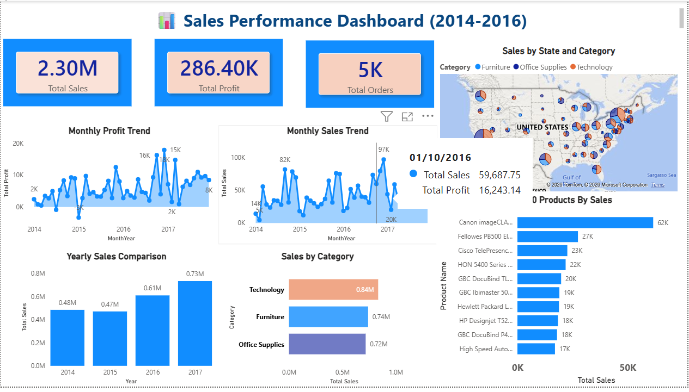

# Sales Performance Dashboard (2016–2017)
- Power BI dashboard analyzing sales trends, profitability, and regional performance (2016–2017).

## 📊 Project Overview
This project analyzes sales performance using Power BI.
It covers sales trends, profit trends, category performance,
top products, and geographic distribution.

## 🛠 Tools Used
- Power BI
- DAX
- Data Modeling
- Power Query

## 📷 Dashboard Preview

## 📈 Key Insights
- Total Sales: 2.30M
- Total Profit: 286K
- Total Orders: 5K
- Technology is the highest-selling category
- Sales increased from 2016 to 2017

## 📂 Files
- Sales_Performance_Dashboard.pbix
- Dashboard screenshots

## 👤 Author
- Amir Payara
- Business Analyst/Data Analyst

